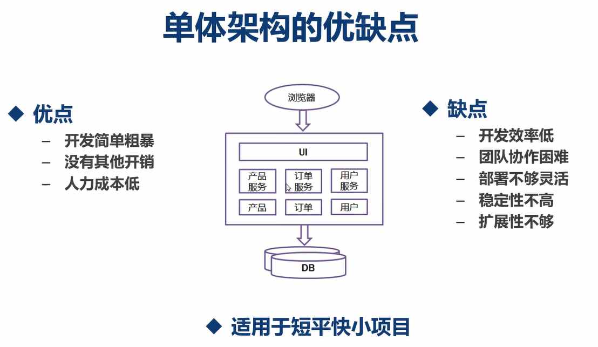
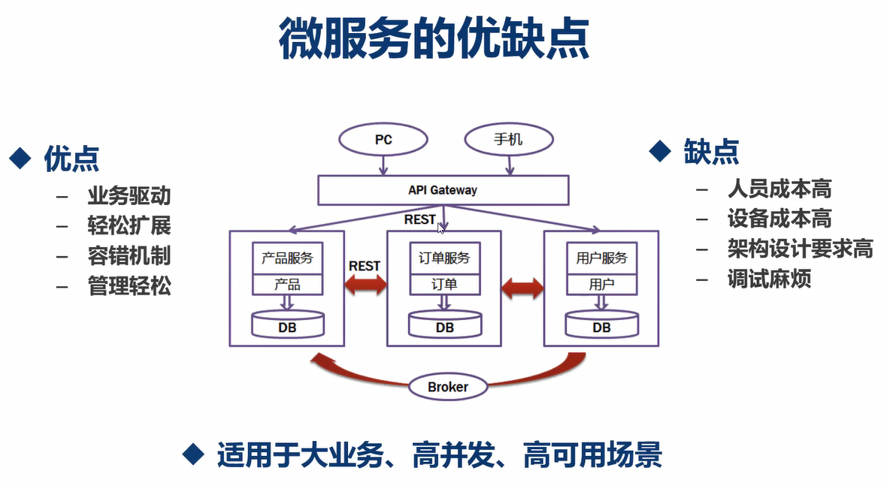
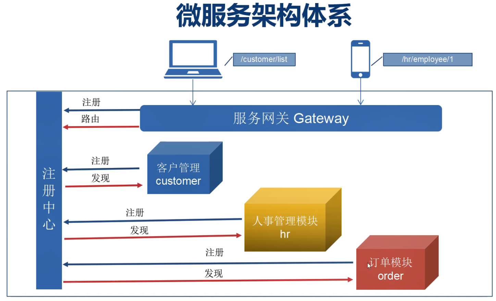
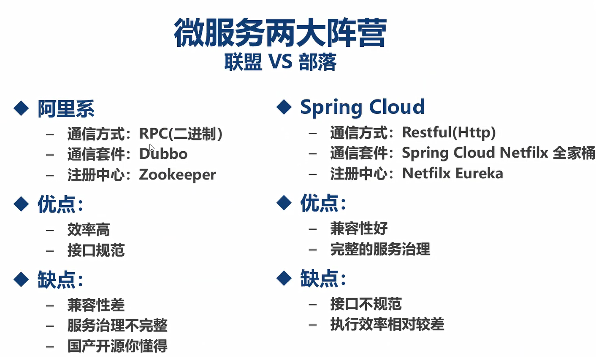
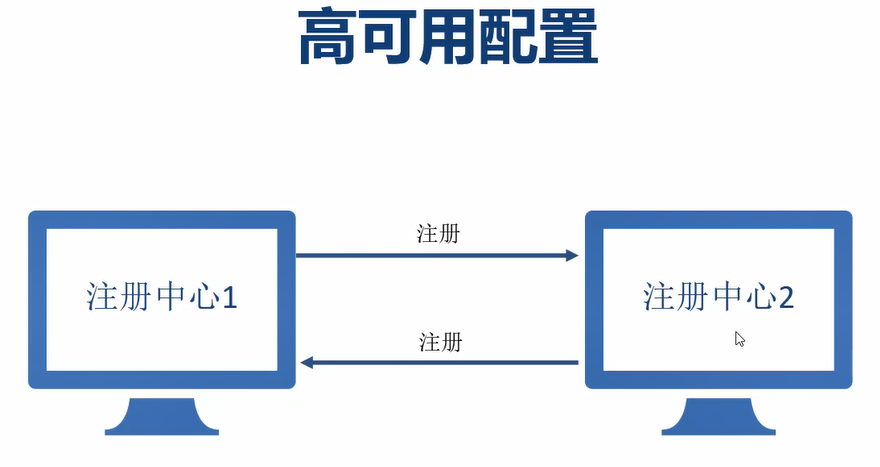

# SpringCloud 基础学习笔记

## 一、基础概念

### 1、微服务架构

#### 1.1 定义
> 微服务是将（单体）应用拆分成一个个独立的服务单元，并通过接口来实现数据的交互。每个独立的（微）服务可以单独部署运行，服务之间可以通过 `RPC` 或 `Restful HTTP` 来相互交互，每个微服务都是由独立的小团队开发，测试，部署，上线，负责它的整个生命周期。


#### 1.2 微服务与分布式的关系
> 微服务是分布式架构的一种形式。
> 
> 系统应用部署在超过一台服务器或虚拟机上，且各分开部署的部分彼此通过各种通讯协议交互信息，就可算作分布式部署，生产环境下的微服务肯定是分布式部署的，分布式部署的应用不一定是微服务架构的，比如集群部署，它是把相同应用复制到不同服务器上，但是逻辑功能上还是单体应用。

#### 1.3 单体架构和微服务架构的优缺点



#### 1.4 微服务架构体系



#### 1.5 微服务架构两大阵营
> Dubbo + ZooKeeper 和 Spring Cloud + Netfilx Eureka



### 2、Spring Cloud

> Spring Cloud 是基于 Spring Boot 的开发便利，对 Netflix 开源组件的进一步封装，极大地简化了微服务的开发

## 二、Spring Cloud 实践

### 1、Spring Cloud 中各大部件及其相互之间的交互

#### 1.0 基础概念

+ Eureka Server（注册中心==服务器端）：注册中心服务器应用（注册中心也可以注册到其他注册中心，实现注册中心的高可用）
+ Eureka Client（注册客户端）：需要注册到注册中心的应用



#### 1.1 注册中心服务器
> 注册中心是分布式架构中最重要的部分，用于服务的注册和发现，所有微服务都必须在注册中心登记后才能被使用

1. 依赖引入：`spring-cloud-starter-netflix-eureka-server`
2. 配置应用名称（`spring.application.name`，该名称将作为注册到注册中心的客户端应用ID）
3. 配置服务器端口号（`server.port`，**Eureka服务器端默认使用**`8761`**作为注册中心的监控端口，也是Eureka客户端的通信端口**）为8761，这一步只是推荐作法，保持注册中心应用端口和监控端口一致
4. 配置取消将自己作为客户端注册到自己启用的注册中心中（默认配置注册，通过 `eureka.client.register-with-eureka = false` 进行取消）
5. 启用注册中心（添加注解 `@EnableEurekaServer`）

注意：Eureka 是服务端和客户端一体的，在启动应用时，会向作为注册中心的自己发送注册请求，但自己还没有启动成功，所以应用启动的时候会报异常错误（`Cannot execute request on any known server`），在没有进行步骤4的情况下，当应用启动完毕之后的一段时间（*心跳包机制*）之后会发现自己作为注册客户端也被注册到注册中心中了（*前提条件是注册中心的端口设置为8761，设置成其他端口还是会注册失败，为什么？？？*），如果进行了步骤4，则不会通过心跳包机制持续发送注册请求（*前提条件是注册中心的端口设置为8761，设置成其他端口还是会持续注册，并报异常，为什么？？？*）

上述问题的关键就在于，心跳包机制如何进行的？服务器端发送？客户端发送？


#### 1.2 各个服务模块（微服务）

1. 依赖引入：`spring-cloud-starter-netflix-eureka-client`和其它作为正常应用的依赖（如`spring-boot-starter-web`）
2. 配置应用名称和端口号：应用名称将作为注册客户端ID，不同应用的端口号应提前规划好
3. 配置注册中心地址：地址可以为多个（多个地址使用 `,` 分隔开 ）
4. 启用注册客户端（添加注解 `@EnableDiscoveryClient`）

问题1：`@EnableDiscoveryClient` 和 `@EnableEurekaClient` 的区别是什么？？？

问题2：当我不添加 `@EnableDiscoveryClient` 或添加 `@EnableEurekaClient` （甚至不配置注册中心地址时）时，服务都能注册到注册中心中（*前提条件是注册中心的端口设置为8761，设置成其他端口还是会注册失败，为什么？？？*）

注意1：客户端停止服务时，注册中心在一段时间内仍然保持注册记录，而且可能会错误地会一直保持注册记录

注意2：
```
# 服务端也会向客户端发送心跳包？？？
# 服务端和客户端通过心跳检查的机制进行交互
# Eureka 客户端每个一段时间向这个地址发送一次心跳包（请求数据），如果发现 Eureka 服务器是启动状态，客户端就会重新注册到注册中心
# 可以添加多个注册中心地址
```

#### 1.3 网关服务

> 网关作为微服务架构中面向客户，是API调用方的统一入口，而网关服务也是一个注册客户端，需要注册到注册中心
> 
> Spring Cloud 中使用 Netflix 中的 Zuul 组件作为网关服务

1. 依赖引入：`spring-cloud-starter-netflix-eureka-client`、`spring-cloud-starter-netflix-zuul`
2. 配置应用名称和端口号：应用名称将作为注册客户端ID
3. 配置注册中心地址：地址可以为多个（多个地址使用 `,` 分隔开 ）
4. 启用注册客户端（添加注解 `@EnableDiscoveryClient`）
5. 启用 Zuul 路由服务（添加注解 `@EnableZuulProxy`）
6. 如果需要可以重新配置各个服务模块的路由路径（`zuul.routes`），默认情况下，通过url访问各个服务模块时需要统一加上应用名称


#### 1.4 配置中心

> 配置中心可以统一配置各个微服务中的配置文件中的信息，而配置中心也是一个注册客户端，需要注册到注册中心

1. 依赖引入：`spring-cloud-starter-netflix-eureka-client`、`spring-cloud-config-server`
2. 配置应用名称和端口号：应用名称将作为注册客户端ID
3. 配置注册中心地址：地址可以为多个（多个地址使用 `,` 分隔开 ）
4. 启用注册客户端（添加注解 `@EnableDiscoveryClient`）
5. 启用配置中心（添加注册 `@EnableConfigServer`）
6. 配置-各个微服务的配置文件存放git信息（地址、用户名、密码） 
7. 重新配置各个微服务
    + pom.xml 中添加依赖： `spring-cloud-config-client`
    + 将 application.yml 删除
    + 新增 bootstrap.yml
    + bootstrap.yml 中配置应用名称和注册中心地址
    + bootstrap.yml 中配置 作为配置中心的信息
    
