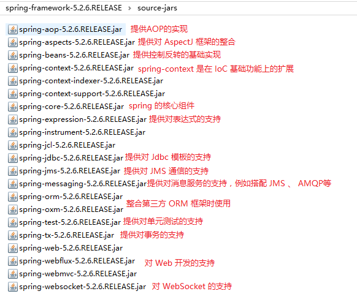
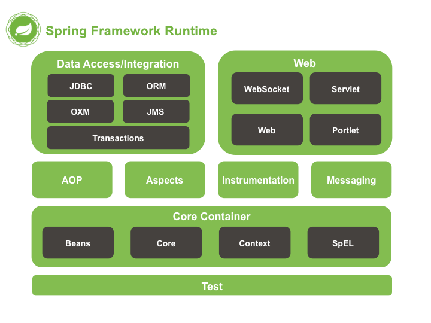
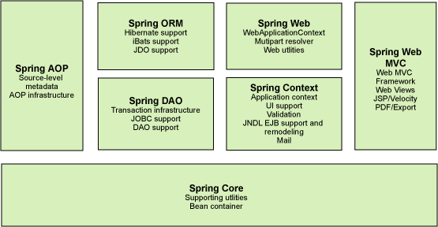
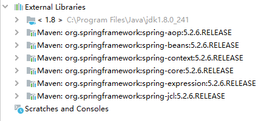

# Spring Framework 学习笔记

## 一、基础概念

### Spring

> 常说的 Spring 实际上是指 Spring Framework，而 Spring Framework 只是 Spring 家族中的一个成员，其他成员还包括 Spring Boot 、 Spring Cloud 、 Spring Security 等，详见可见[官网](https://spring.io/projects)。
> 
> Spring 是为了解决企业级应用开发的复杂性而创建的。

Spring 提供了许多组件，从而支持诸多功能



#### Spring 是如何简化了企业应用程序开发的？
> Spring 通过其自身的分层体系结构，能够允许开发者按需选择使用组件。

#### Spring 的分层体系结构
> Spring 的分层体系结构如下图所示，主要由7个模块（组件）组成。组成 Spring 框架的每个模块都可以单独存在，也可以与其他一个或多个模块联合使用。

#### Spring 的模块





+ Spring Core：Spring 核心模块，其提供了 Spring框架的基本功能，是 Spring 框架最基础的部分。它提供了依赖注入（Dependency Injection，简称DI）特征来实现容器对 Bean 的管理。其中最基本的概念就是 BeanFactory，它也是任何 Spring 应用的核心，它使用控制反转（Inversion of Control，简称IoC）将应用配置和依赖说明从实际的应用代码中分离出来。

+ Spring Context：又称 Spring 上下文模块，向 Spring 框架提供上下文信息。核心模块的 BeanFactory 使 Spring 成为一个容器，而上下文模块使其成为一个框架。上下文模块扩展了 BeanFactory 的概念，增加了对国际化（I18N）消息、事件传播以及验证的支持。另外，这个模块提供了许多企业服务，例如电子邮件、JNDL 访问、EJB 集成、远程以及时序调度服务。

+ Spring AOP：Spring AOP 模块为 Spring 框架提供了对面向切面编程（Aspect Oriented Programming，简称 AOP）的丰富支持，该模块是 Spring 应用实现面向切面编程的基础。此外，AOP 模块也将元数据编程引入了 Spring，使用 Spring 的元数据支持，开发者可以为源代码增加注释，指示 Spring 在何处以及如何应用切面函数。

+ Spring DAO：Spring 的 DAO 模块抽取了使用 JDBC 时的重复代码，使得开发者可以保持数据库访问代码的干净简洁，并且可以防止因关闭数据库资源失败而引起的问题。

+ Spring ORM：Spring ORM 模块提供了对若干 ORM 框架的支持，包括 JDO、Hibernate 和 iBatis。

+ Spring Web：Spring Web 模块建立了一个基于应用上下文模块之上的 Web 上下文模块，为基于 Web 的应用程序提供了上下文。此外，Web 模块还提供了一些面向服务支持。如：实现文件上传的 multipart 请求。它也提供了 Spring 和其它 Web 框架的集成，比如 Struts、WebWork。

+ Spring Web MVC：Spring Web MVC 模块提供了一个全功能的构建 Web 应用程序的 MVC 框架。

### IoC/DI

> IoC（Inversion of Control），中文译为控制反转。控制反转是一种思想，是指对一个对象的控制权的反转。

普通方式下，对象由创建（包含初始化）由开发者自己通过 new() 的方式完成。
```Java
class Book{}
public class Demo{
    public void static main(String[] args){
        Book book = new Book();
        // 对book对象进行使用...
    }
}
```

控制反转思想，就是指将对象的创建、初始化和销毁等操作交给 Spring IoC 容器管理。在项目启动时，所有的 Bean 会注册到容器中，如果 Bean 对象之间有依赖关系，不需要自己去 new()，而是由 Spring IoC 容器发现并提供。

> 由于控制反转概念比较含糊，所以在 2004 年大师级人物 Martin Fowler 又给出了一个新的名字：“依赖注入”，相对IoC 而言，“依赖注入”明确描述了“被注入对象依赖 IoC 容器来配置依赖对象”。
> 
> Spring 中 IoC/DI 特性本质上是通过 XML 解析和 Java 反射机制来实现的。

### AOP

> AOP（Aspect Oriented Programming），中文译为面向切面编程，它是一种编程范式，主要适用场景就是将非功能性需求和功能性需求分离，并将非功能性需求代码嵌入到功能性需求代码中，以对 OOP（面向对象编程） 起到补充作用。

代码分离的主要目的有两个，第一个是使代码的重用性增强，减少代码的重复；第二个是代码结构更加清晰。常见的分离模式主要有以下几种：
+ 水平分离：前后端分离；Controller 层、Service 层、Dao 层的分离
+ 垂直分离：按业务划分模块（如订单模块、库存模块等）-- 多模块的划分和微服务
+ 切面分离：功能性需求和非功能性需求的划分

常见的非功能性需求包括：权限控制、缓存控制、事务控制、日志、性能监控、异常处理、分布式追踪等

AOP 的基础概念

+ 增强（Advice，也有的称为通知）：定义了切面需要完成的工作，包括工作内容（做什么）和工作时间（何时做）
+ 切点（Pointcut）：定义了增强被应用的位置，即定义了切面指定工作（某一个增强）的工作地点（何地做）
+ 切面（Aspect）：是多组增强和切点的集合，定义了切面的全部功能（何时何地做什么）
+ 连接点（JoinPoint）：切点的定义

## IoC/DI
### IoC/DI XML 配置

#### IoC 初体验

1. 创建一个普通 Maven 项目，并引入 spring-context 依赖
   ```xml
   <dependencies>
        <dependency>
            <groupId>org.springframework</groupId>
            <artifactId>spring-context</artifactId>
            <version>5.2.6</version>
        </dependency>
    </dependencies>
   ```
   **注**：由于依赖关系，spring-context 依赖引入后，项目将引入 spring 的基础 jar 包
   
2. 在 resources 目录下创建 spring 的配置文件
   ```xml
   <?xml version="1.0" encoding="UTF-8"?>
    <beans xmlns="http://www.springframework.org/schema/beans"
        xmlns:xsi="http://www.w3.org/2001/XMLSchema-instance"
        xsi:schemaLocation="http://www.springframework.org/schema/beans http://www.springframework.org/schema/beans/spring-beans.xsd">

    </beans>
   ```
3. 配置需要注入的 Bean
   ```xml
   <?xml version="1.0" encoding="UTF-8"?>
    <beans xmlns="http://www.springframework.org/schema/beans"
        xmlns:xsi="http://www.w3.org/2001/XMLSchema-instance"
        xsi:schemaLocation="http://www.springframework.org/schema/beans http://www.springframework.org/schema/beans/spring-beans.xsd">

        <bean class="org.daistudy.springframework.ioc.xml.model.Book" id="book"/>
    </beans>
   ```
4. 加载配置文件，并获取对象
   ```java
   /**
    * 不同方式去加载配置文件时，会加载多次，并构成多个 Spring IoC 容器
    */
    public class FirstStart {
        public static void main(String[] args) {
            // ClassPathXmlApplicationContext 会从 classpath 下查找配置文件
            ClassPathXmlApplicationContext applicationContext1 = new ClassPathXmlApplicationContext("applicationContext.xml");
            // FileSystemXmlApplicationContext 从操作系统路径（绝对路径或相对路径）下查找配置文件
            FileSystemXmlApplicationContext applicationContext2 = new FileSystemXmlApplicationContext("SpringIocXml/src/main/resources/applicationContext.xml");
            final Object book1 = applicationContext1.getBean("book");
            final Object book2 = applicationContext2.getBean("book");
            System.out.println(book1);
            System.out.println(book2);
        }
    }
   ```
   **注**：加载方式，除了 `ClassPathXmlApplicationContext` 去 classpath 下查找配置文件，另外也可以使用 `FileSystemXmlApplicationContext` 从操作系统路径（绝对路径或相对路径）下查找配置文件

#### Bean 的获取

> Bean 的获取不仅可以通过 **名称** 去获取，也可以通过 **类型**（Class） 去获取

+ 如果通过类型去获取 Bean，需要先确保 Spring IoC 容器中只包含一个该类的实例 Bean，如果包含多个，则运行时会出现 `NoUniqueBeanDefinitionException` 异常
+ xml 配置 bean 时，可以设置 id 或 name 属性指定 bean 的名称，一般情况下，两者没有区别，特殊情况：
    1. id="user1,user2"==> bean 的名称为 "user1,user2"
    2. name="user1,user2"==> bean 的名称为 "user1" 或 "user2"

#### 属性的注入

> 属性的注入存在多种方式，主要有：构造方法注入、set方法注入和 P 名称空间注入

示例如下：
```xml
<!-- 构造方法注入：index（参数位置） -->
<bean class="org.daistudy.springframework.ioc.xml.model.Book" id="book3">
    <constructor-arg index="0" value="0"/>
    <constructor-arg index="1" value="第一本书"/>
</bean>

<!-- 构造方法注入：name（参数名） -->
<bean class="org.daistudy.springframework.ioc.xml.model.Book" id="book4">
    <constructor-arg name="id" value="1"/>
    <constructor-arg name="name" value="第二本书"/>
</bean>

<!-- set方法注入：name属性名是通过 Java 中的内省机制分析出来的属性名，简单说，就是根据 get/set 方法分析出来的属性名 -->
<bean class="org.daistudy.springframework.ioc.xml.model.Book" id="book5">
    <property name="id" value="2"/>
    <property name="name" value="第三本书"/>
</bean>

<!-- p名称空间注入：需要先引入p名称空间，底层也是通过 set 方法注入的 -->
<bean class="org.daistudy.springframework.ioc.xml.model.Book" id="book6" p:id="3" p:name="第四本书">
</bean>
```

#### 外部 Bean 的注入

> 当使用一些外部 Bean 时，这些 Bean 可能没有构造方法，而是通过 Builder 来构造，此时如果想要注入这些 Bean 时，存在两种注入方法：静态工厂注入和实例工厂注入

##### 静态工厂注入

```java
public class OkHttpUtils {
    private static OkHttpClient okHttpClient;
    public static OkHttpClient getInstance(){
        if(okHttpClient == null){
            okHttpClient = new OkHttpClient.Builder().build();
        }
        return okHttpClient;
    }
}
```

```xml
<bean class="org.daistudy.springframework.ioc.xml.utils.OkHttpUtils" factory-method="getInstance" id="okHttpClient"/>
```

##### 实例工厂注入

```java
public class OkhttpUtilsWithObject {
    private OkHttpClient okHttpClient;
    public OkHttpClient getInstance(){
        if(okHttpClient == null){
            okHttpClient = new OkHttpClient.Builder().build();
        }
        return okHttpClient;
    }
}
```

```xml
<bean class="org.daistudy.springframework.ioc.xml.utils.OkhttpUtilsWithObject" id="okhttpUtilsWithObject"/>
<bean class="okhttp3.OkHttpClient" factory-bean="okhttpUtilsWithObject" factory-method="getInstance" id="okHttpClient2"/>
```

#### 复杂属性的注入

> 此处的复杂属性主要包括：对象（ref）、数组（array）、List（list）、Set（set）、Map（map）、Properties（props）

```java
// get/set方法省略
public class Cat {
    private String name;
    private String color;
}

public class User {
    private Integer id;
    private String name;
    private Cat cat;
    private String[] favorities;
    private List<Cat> cats;
    private Map<String, Object> map;
}
```

```xml
<bean class="org.daistudy.springframework.ioc.xml.model.User" id="user">
    <property name="id" value="1"/>
    <property name="name" value="小王"/>
    <!-- ref 引入 Spring IoC 容器中的其它 bean -->
    <property name="cat" ref="cat"/>
    <!-- 数组使用 array 节点注入 -->
    <property name="cats">
        <array>
            <ref bean="cat"/>
            <bean class="org.daistudy.springframework.ioc.xml.model.Cat" id="cat2" p:name="小花" p:color="花色"/>
        </array>
    </property>
    <!-- list 使用 list 节点注入 -->
    <property name="favorities">
        <list>
            <value>足球</value>
            <value>篮球</value>
        </list>
    </property>
    <!-- map 使用 map 节点注入 -->
    <property name="map">
        <map>
            <entry key="name" value="javaboy"/>
            <entry key="age" value="18"/>
        </map>
    </property>
    <!-- properties 使用 props 节点注入 -->
    <property name="properties">
        <props>
            <prop key="name">javaboy</prop>
            <prop key="age">20</prop>
        </props>
    </property>
</bean>

<bean class="org.daistudy.springframework.ioc.xml.model.Cat" id="cat" p:name="小白" p:color="白色"/>
```

### IoC/DI Java 配置

在 Java 配置中:

+ @Configuration 注解将该类声明一个 Java Bean 的配置类，作用相当于 XML 配置中的 applicationContext.xml 文件
+ @Bean 注解将该方法的返回值作为一个 Java Bean，作用相当于 XML 配置中的 applicationContext.xml 文件中的 bean 节点（标签）
+ ApplicationContext 是通过 `new AnnotationConfigApplicationContext(JavaConfig.class)` 获取

> JavaConfig 配置类本身也被 Spring 容器看为一个 Bean

#### 属性的注入

> 属性的注入存在多种方式，主要有：构造方法注入、set方法注入

##### 属性上添加注解 @Autowired 或 @Resource -- 字段名作为 Bean 默认名称
对象的注入：自动扫描时，如果对象间存在依赖关系，可以通过注解 @Autowired 或 @Resource 实现自动装配
   + @Autowired：根据名称（字段名 == bean 名）去查找，如果通过名称找不到，会根据类型去找，如果该类型有多个会报错，如果需要指定名称可以搭配 @Qualifier（指定 Bean 的名称）使用
   + @Resource：根据名称（字段名 == bean 名）去查找，如果通过名称找不到，会根据类型去找，如果该类型有多个会报错，可以直接指定名称

```java
@Autowired
UserDao userDao;
```

##### set 方法添加注解（@Autowired 或 @Resource）-- 参数名作为 Bean 默认名称
```java
@Autowired
public void setUserDao(UserDao userDao){
    this.userDao = userDao;
}
```

##### 构造方法注入，不需要添加注解 -- 参数名作为 Bean 默认名称
```java
public UserService(UserDao userDao){
    this.userDao = userDao;
}
```


#### 外部 Bean 的注入

> 当使用一些外部 Bean 时，这些 Bean 可能没有构造方法，而是通过 Builder 来构造，此时如果想要注入这些 Bean 时，存在多种注入方法：静态工厂注入（类似与 xml）、实例工厂注入（类似与 xml）和实现 `FactoryBean` 进行注入

##### 静态工厂注入

```java
public class OkHttpUtils {
    private static OkHttpClient okHttpClient;
    public static OkHttpClient getInstance(){
        if(okHttpClient == null){
            okHttpClient = new OkHttpClient.Builder().build();
        }
        return okHttpClient;
    }
}
```

```java
@Bean("staticOkHttpClient")
OkHttpClient staticOkHttpClient(){
    return OkHttpUtils.getInstance();
}
```

##### 实例工厂注入

```java
public class OkhttpUtilsWithObject {
    private OkHttpClient okHttpClient;
    public OkHttpClient getInstance(){
        if(okHttpClient == null){
            okHttpClient = new OkHttpClient.Builder().build();
        }
        return okHttpClient;
    }
}
```

```java
@Bean("nonStaticOkHttpClient")
OkHttpClient nonStaticOkHttpClient(OkhttpUtilsWithObject okhttpUtilsWithObject){
    return okhttpUtilsWithObject.getInstance();
}

@Bean
OkhttpUtilsWithObject okhttpUtilsWithObject(){
    return new OkhttpUtilsWithObject();
}
```

##### 通过 FactoryBean 实现（类似与实例工厂方法）
```java
public class FactoryDemoBean {
}

public class FactoryDemo implements FactoryBean<FactoryDemoBean> {
    @Override
    public FactoryDemoBean getObject() {
        return new FactoryDemoBean();
    }

    @Override
    public Class<?> getObjectType() {
        return FactoryDemoBean.class;
    }
}
```

```java
@Bean
FactoryDemo factoryDemo(){
    return new FactoryDemo();
}

@Bean
FactoryDemoBean factoryDemoBean(FactoryDemo factoryDemo) {
    return factoryDemo.getObject();
}
```

### IoC/DI 自动化配置

1. 通过注解 @Component（@Controller、@Service、@Repository、@Configuration）配置需要扫描的类
2. 配置自动化扫描
   + Java 配置
        ```java
        @Configuration
        @ComponentScan(basePackages = "org.daistudy.springframework.ioc.java", useDefaultFilters = true, excludeFilters = {
                @ComponentScan.Filter(type = FilterType.ANNOTATION, classes = Controller.class)
        })
        public class JavaConfig {}
        ```
   + xml 配置
        ```xml
        <context:component-scan base-package="org.daistudy.springframework.ioc.xml" use-default-filters="true">
            <context:exclude-filter type="annotation" expression="org.springframework.stereotype.Controller"/>
        </context:component-scan>
        ```


### IoC/DI 条件注解

#### @Conditonal
> 同一个接口返回不同的实现类实例，并依据满足的条件进行返回

```java
// 同一个接口
public interface ShowCmd {
    String showCmd();
}

// 第一个实现类
public class WindowsShowCmd implements ShowCmd {
    @Override
    public String showCmd() {
        return "dir";
    }
}

// 第二个实现类
public class LinuxShowCmd implements ShowCmd {
    @Override
    public String showCmd() {
        return "ls";
    }
}

// 条件1
public class WindowsCondition implements Condition {
    @Override
    public boolean matches(ConditionContext conditionContext, AnnotatedTypeMetadata annotatedTypeMetadata) {
        return conditionContext.getEnvironment().getProperty("os.name").toLowerCase().contains("windows");
    }
}

// 条件2
public class LinuxCondition implements Condition {
    @Override
    public boolean matches(ConditionContext conditionContext, AnnotatedTypeMetadata annotatedTypeMetadata) {
        return conditionContext.getEnvironment().getProperty("os.name").toLowerCase().contains("linux");
    }
}

// 条件注解进行配置在不同条件下返回不同实现类的实例，并且指定相同的 bean 名称
@Configuration
public class JavaConfig {
    @Bean("showCmd")
    @Conditional(WindowsCondition.class)
    ShowCmd winCmd(){
        return new WindowsShowCmd();
    }

    @Bean("showCmd")
    @Conditional(LinuxCondition.class)
    ShowCmd linuxCmd(){
        return new LinuxShowCmd();
    }
}
```

#### @Profile

> @Profile 底层也是基于 @Conditional 注解

```java
// profile 指定多环境的实例
@Configuration
public class JavaConfig {
    @Bean("ds")
    @Profile("dev")
    DataSource devDataSource(){
        final DataSource dataSource = new DataSource();
        dataSource.setUrl("jdbc:mysql://127.0.0.1:3306/dev");
        dataSource.setUsername("dev");
        dataSource.setPassword("dev");
        return dataSource;
    }

    @Bean("ds")
    @Profile("prod")
    DataSource prodDataSource(){
        final DataSource dataSource = new DataSource();
        dataSource.setUrl("jdbc:mysql://127.0.0.1:3306/prod");
        dataSource.setUsername("prod");
        dataSource.setPassword("prod");
        return dataSource;
    }
}

// 自己使用profile时，需要先通过无参构造，然后设置 profile ，再加载（注册）配置文件，最后刷新
public class ProfileDemo {
    public static void main(String[] args) {
        final AnnotationConfigApplicationContext applicationContext = new AnnotationConfigApplicationContext();
        applicationContext.getEnvironment().setActiveProfiles("dev");
        applicationContext.register(JavaConfig.class);
        applicationContext.refresh();
        final DataSource ds = applicationContext.getBean("ds", DataSource.class);
        System.out.println(ds);
    }
}
```

### IoC/DI Bean 的作用域（生命周期）

> Bean 的作用域类型主要有四种：
> + singleton：单例形式，每次请求的都是同一个 Bean
> + prototype：原型形式，每次请求的都是一个新的 Bean
> + request：Bean 的生命周期与 request 同步
> + session：Bean 的生命周期与 session 同步
> 
> 默认情况下，bean 的生命周期类型是 singleton 类型，可以通过 @Scope 注解或 bean 标签中 scope 属性来指定为其他类型

### IoC/DI 混合配置

> 一般情况下，注入 Bean 的方式，不是通过 XML 配置，就是通过 Java 配置，如果想要同时将两种配置生效（即混合配置），则需要在 Java 配置中通过 `@ImportResource` 注解导入 XML 配置文件，应用时通过 Java 配置获取 Bean，此时 Java 配置和 XML 配置的 Bean 都可以获取到。

```java
@Configuration
@ImportResource({"classpath:applicationContext.xml"})
public class JavaConfig {

}
```

### IoC/DI Aware 接口

> Aware 接口提供了一个 set 方法，方法的参数就是当前 Bean 需要感知的内容，因此我们需要在 Bean 中声明相关的成员变量来接受这个参数。接收到这个参数后，就可以通过这个参数获取到容器的详细信息了。

```java
@Component
public class UserAware implements ApplicationContextAware {
    private ApplicationContext applicationContext;
    @Override
    public void setApplicationContext(ApplicationContext applicationContext) throws BeansException {
        this.applicationContext = applicationContext;
    }

    public String sayHello(){
        final boolean hasUserDao = this.applicationContext.containsBean("userDao");
        if (hasUserDao) {
            final UserDao userDao = this.applicationContext.getBean("userDao", UserDao.class);
            return userDao.hello();
        }
        return "bean 'userDao' is not existed.";
    }
}
```

## AOP

### Spring AOP 的五种通知

> Spring AOP 的五种通知分别为：前置通知、后置通知、异常通知、返回通知和环绕通知

1. 引入 Spring 依赖和 Aop 相关依赖
   ```xml
   <dependency>
        <groupId>org.springframework</groupId>
        <artifactId>spring-context</artifactId>
    </dependency>
    <dependency>
        <groupId>org.aspectj</groupId>
        <artifactId>aspectjweaver</artifactId>
    </dependency>
    <dependency>
        <groupId>org.aspectj</groupId>
        <artifactId>aspectjrt</artifactId>
    </dependency>
   ```
2. 定义切点
   + 使用注解
        ```java
        // 定义注解
        @Target({ElementType.METHOD})
        @Retention(RetentionPolicy.RUNTIME)
        public @interface Action {
        }

        // 使用注解
        @Component("myCalculator")
        public class MyCalculatorImpl {
            @Action
            public Integer add(int a, int b){
                return a + b;
            }

            public Integer minus(int a, int b){
                return a - b;
            }
        }
        ```
   + 使用规则
        ```java
        @Pointcut("execution(* org.daistudy.springframework.aop.simpledemo.*.*(..))")
        public void pointcut2(){}

        // 在切面中的统一使用方式
        // @Before(value = "pointcut2()")
        ```
3. 定义切面
    ```java
    @Component
    @Aspect // 表示这是一个切面
    public class ActionAspect {
        // 统一定义切点
        @Pointcut("@annotation(Action)")
        public void pointcut(){}

        // 在切面中的直接使用方式
        // @Before(value = "@annotation(Action)")

        // 在切面中的统一使用方式
        // @Before(value = "pointcut()")

        // 前置通知
        @Before(value = "@annotation(Action)")
        public void before(JoinPoint joinPoint){
            final Signature signature = joinPoint.getSignature();
            final String name = signature.getName();
            System.out.println(name + "方法开始执行...");
        }
        // 后置通知
        @After(value = "@annotation(Action)")
        public void after(JoinPoint joinPoint){
            final Signature signature = joinPoint.getSignature();
            final String name = signature.getName();
            System.out.println(name + "方法执行结束...");
        }
        // 返回通知
        @AfterReturning(value = "@annotation(Action)", returning = "r")
        public void returing(JoinPoint joinPoint, Integer r){
            final Signature signature = joinPoint.getSignature();
            final String name = signature.getName();
            System.out.println(name + "方法返回：" + r);
        }
        // 异常通知
        @AfterThrowing(value = "@annotation(Action)", throwing = "e")
        public void afterThrowing(JoinPoint joinPoint, Exception e){
            final Signature signature = joinPoint.getSignature();
            final String name = signature.getName();
            System.out.println(name + "方法抛异常了：" + e.getMessage());
        }
        // 环绕通知
        @Around(value = "@annotation(Action)")
        public Object around(ProceedingJoinPoint joinPoint){
            final Signature signature = joinPoint.getSignature();
            final String name = signature.getName();

            Object proceed = null;
            try {
                System.out.println(name + "方法开始执行...around");
                proceed = joinPoint.proceed();
                System.out.println(name + "方法执行结束...around");
            } catch (Throwable throwable) {
                throwable.printStackTrace();
                System.out.println(name + "方法抛异常了：" + throwable.getMessage() + "around");
            }
            System.out.println(name + "方法返回：" + proceed + "around");
            return proceed;
        }
    }
    ```
4. 开启包扫描和自动代理
   ```java
    @Configuration
    @ComponentScan(basePackages = "org.daistudy.springframework.aop.simpledemo")
    @EnableAspectJAutoProxy // 开启自动代理
    public class JavaConfig {
    }
   ```

## 数据库

### JdbcTemplate

1. 引入 `spring-jdbc` 依赖（该依赖会依赖 `spring-tx` 依赖）
2. 在配置内中配置 `DataSource` 和 `JdbcTemplate` 两个 Bean：
   ```java
   @Bean
    DataSource dataSource(){
        final DriverManagerDataSource dataSource = new DriverManagerDataSource();
        dataSource.setDriverClassName("com.mysql.jdbc.Driver");
        dataSource.setUrl("jdbc:mysql://localhost:3306/test");
        dataSource.setUsername("root");
        dataSource.setPassword("root");

        return dataSource;
    }

    @Bean
    JdbcTemplate jdbcTemplate(DataSource dataSource){
        return new JdbcTemplate(dataSource);
    }
   ```
3. 使用 JdbcTemplate 

### 事务

**为使事务生效**：
1. 在配置类上开启事务管理：@EnableTransactionManager
2. 在配置类中配置 Bean ：默认可以直接返回一个 DataSourceTransactionManager
3. 在需要使用事务的类和方法上配置：
   + 类必须注册到 Spring IoC 容器中；
   + 在方法上使用注解 @Transactional

